# 乐思平台
## 单体应用版本
https://gitee.com/libihao520/ai-recognition-system

[](https://gitee.com/libihao520/ai-recognition-system/stargazers)[](https://gitee.com/libihao520/ai-recognition-system/members)
## 微服务版本
1. （前端） LeSi-Platform-Web： https://github.com/Libihao520/LeSi-Platform-Web
2. （网关/聚合层） LeSi-Platform-Api： https://github.com/Libihao520/LeSi-Platform-Api
3. （管理后台核心） LeSi-Admin-Api： https://github.com/Libihao520/LeSi-Admin-Api
4. （AI处理核心） LeSi-AI-Api： https://github.com/Libihao520/LeSi-AI-Api

## 演示地址
http://47.107.226.106:8080/login
 - 账号：lbhlbh
 - 密码：123456
## 功能模块

1.  登录注册
2.  数据大屏
3.  题库系统
4.  AI模块
5.  工具箱
6.  个人中心

## 框架与技术栈
 - 基于微软.NetCore8.0、.NetCore9.0开发，采用了主流数据库 MySQL、Redis，ORM 框架为 EFCore Dapper
 - 后端：
    • Platform-Api (网关/聚合层)：.NET 8 MVC, EFCore, SignalR, Autofac, AutoMapper, EPPlus, SharpDocx, QRCode。
    • AI Server (AI处理核心)；.NET 8, Dapper, RabbitMQ/Kafka, YoloDotNet, ONNX。
    •Admin Server (管理后台核心)： .NET 8, DDD, 中介者模式, CQRS, EFCore仓储, 动态密钥, gRPC。
 - 前端：vue3、nodejs、vuex、axios请求、promise、element ui、element plus、pinia用户仓库与token持久化
 - 服务通讯：gRPC (内部), 消息队列 (异步解耦), SignalR (前后端实时)。
 - 运维部署：Kubernetes (k8s), Docker, Jenkins CI/CD。

## 项目流程图
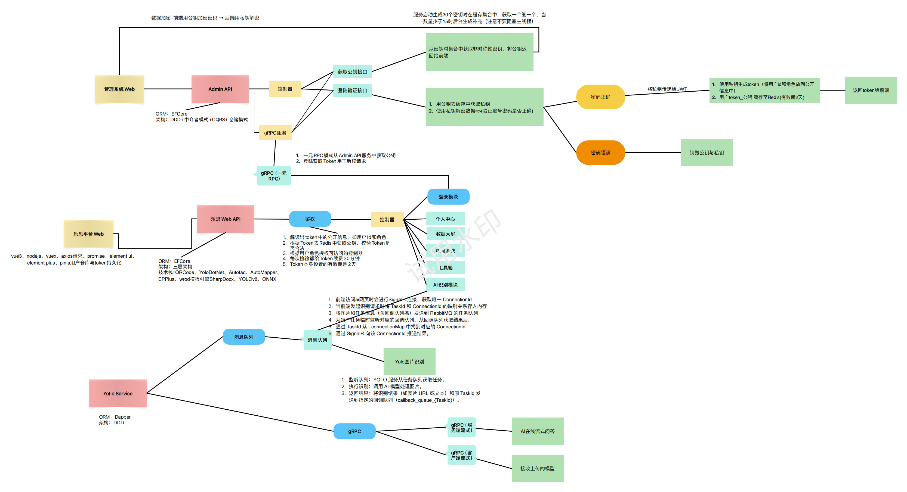

## 详细介绍
提示：因本开源项目还在开发阶段，下面介绍可能和实际项目有所差异
#### 🐳 项目截图  

| 网页 | 截图 |
|---------------------|---------------------|
| 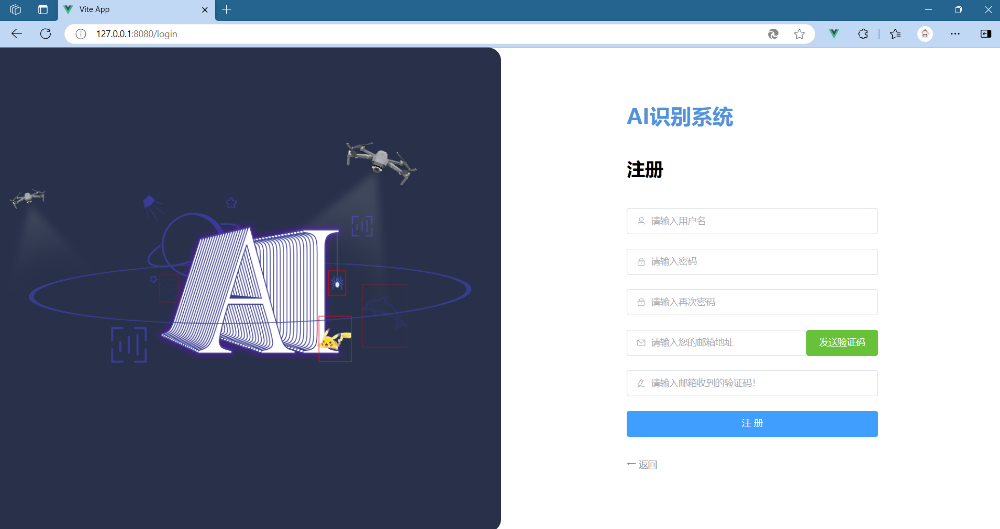  | 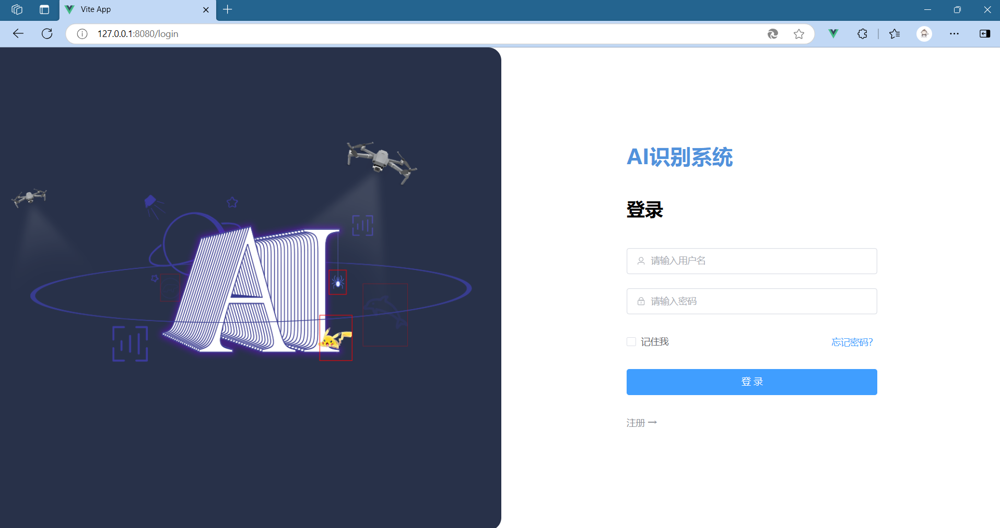 |
| 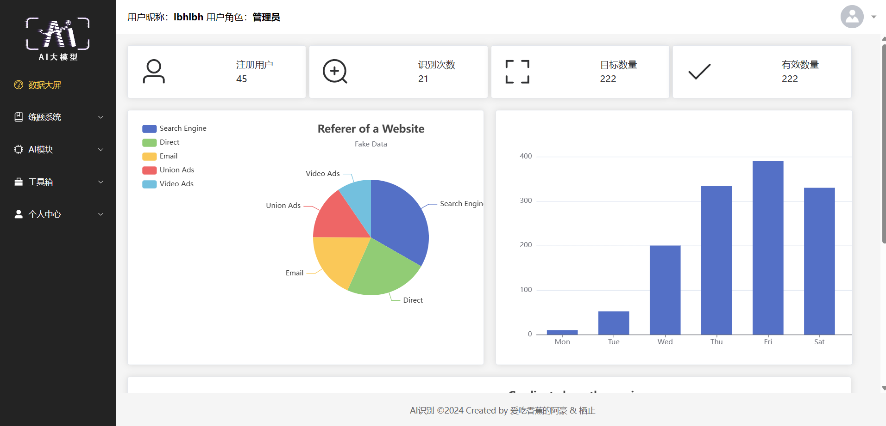  |  |
| 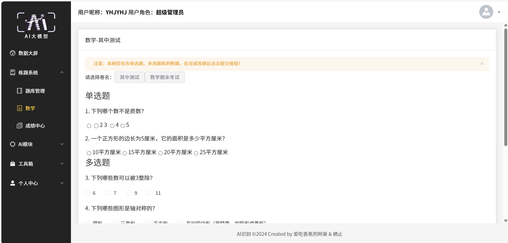  | 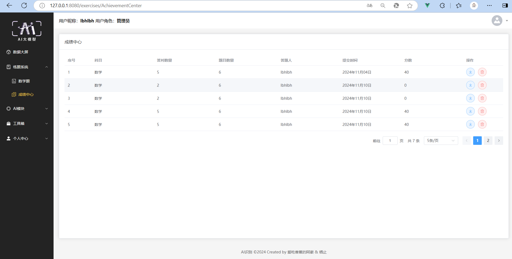 |
| 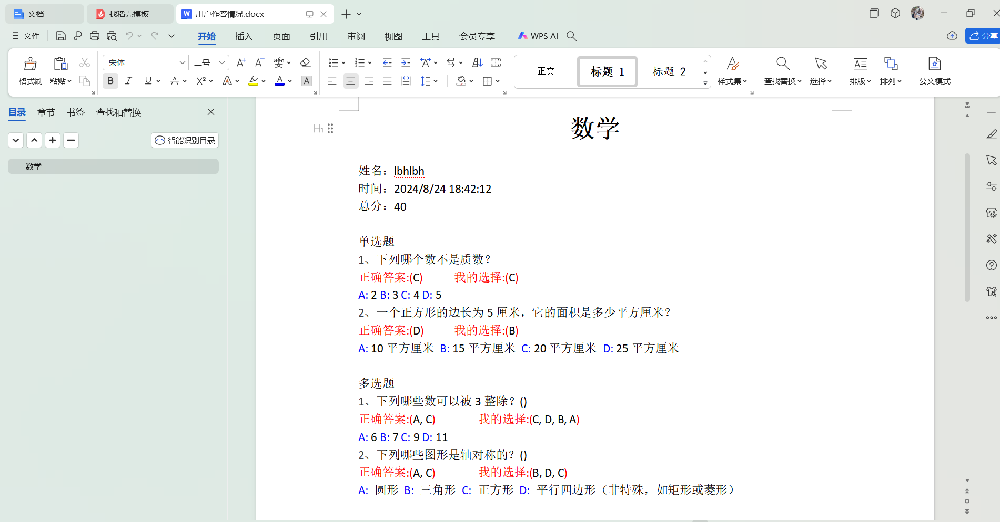  | |
|   | 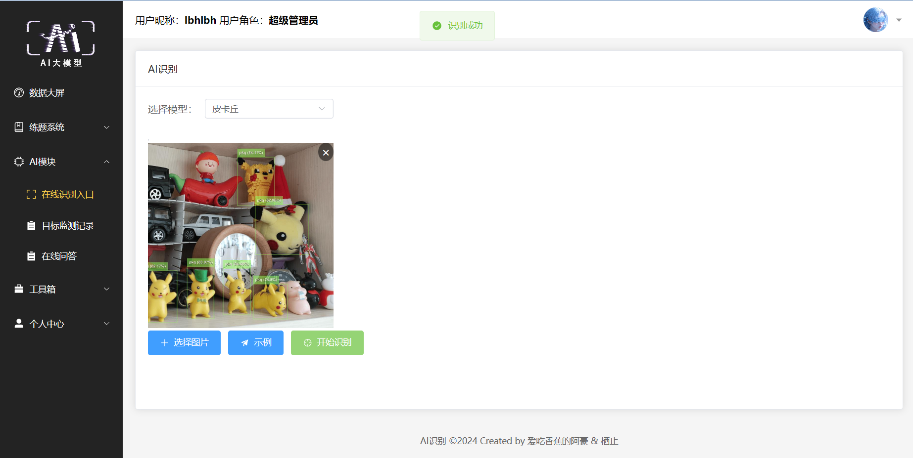 |
| 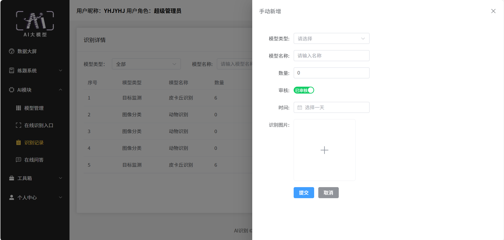  |  |
| 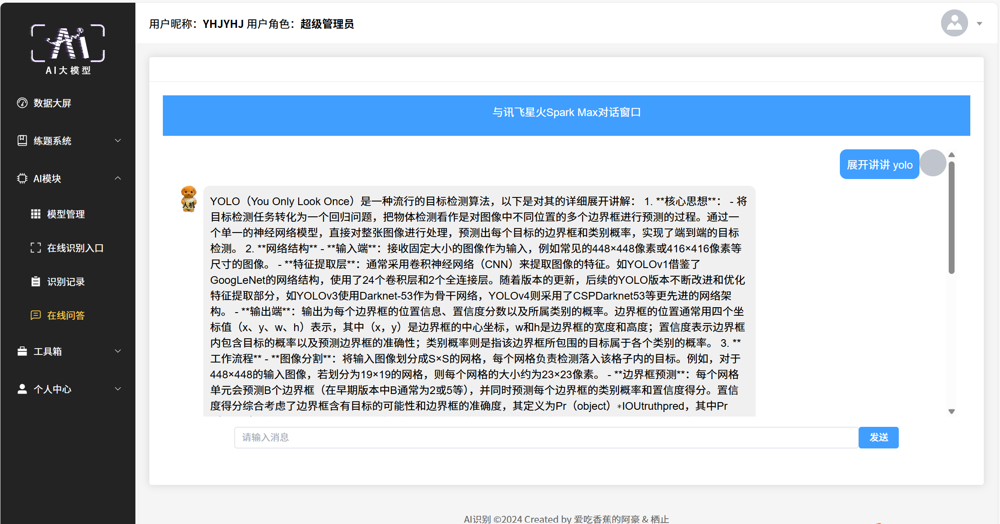  | 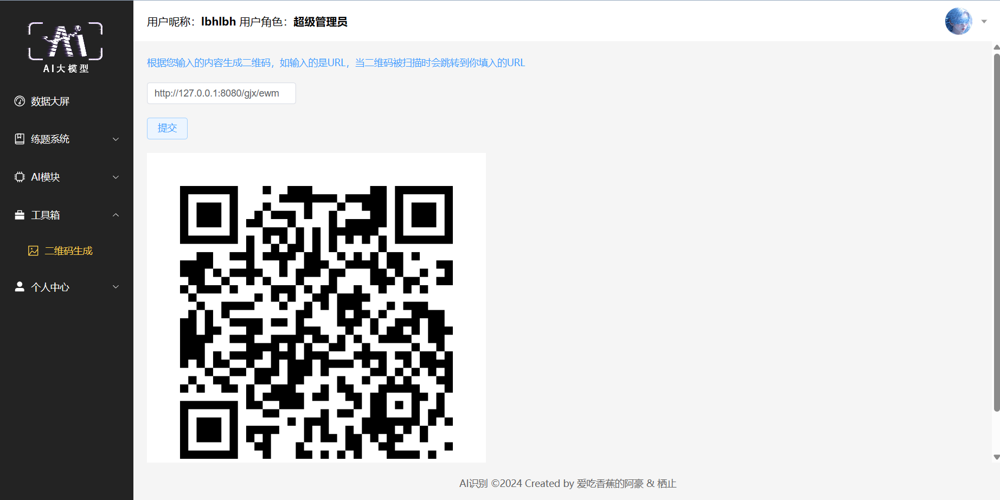 |
| 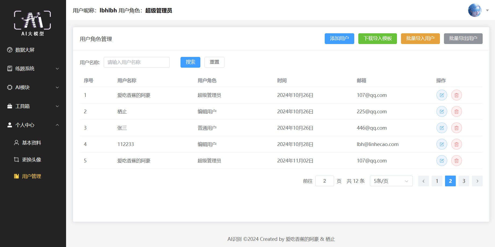  | 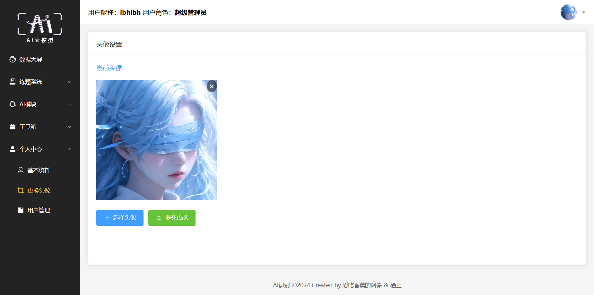 |

| 系统流程图 | E-R图 |
|---------------------|---------------------|
| 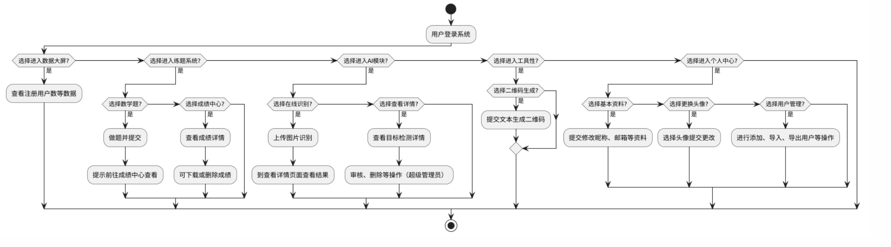  |  |

## 安装教程
具体部署方案看下面blog⬇️
https://libihao.blog.csdn.net/article/details/149899677
```
因为我的演示模型过大，我单独上传到了百度云网盘了，如果需要的话请自行下载
通过网盘分享的文件：Model
链接: https://pan.baidu.com/s/1sTZ8uQLpyrl3hygkZ3VmvA?pwd=ewfk 提取码: ewfk
模型下载下来后放到路径 ai-recognition-system\Ai-Web-API\WebApi\Model 下
```

## 开发人员

1.  爱吃香蕉的阿豪
2.  栖止


